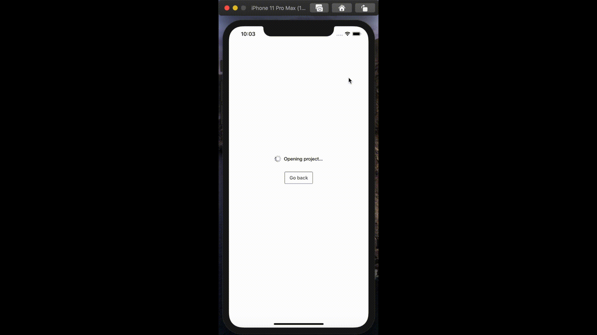

# What is Be The Hero?

Be the hero in an application where Non Governmental Organizations (NGO's) can publish incidents trough a web page that they want to solve and the budget needed to solve each incident. Afterwards, people from society can look in a mobile app all incidents that NGO's has published, choose one or more, and enter in contact by Email or Whatsapp with the NGO and donate money in order to help with the budget for the incident.

## How NGO's can use the app:

- Acessing the web, publishing new incidents.

## How people from society can use the app

- Acessing the mobile app, search for new cases and entering in contact with NGO's.

## Example of the app runing:

> PS: When user clicks at the Whatsapp / E-mail button, the app open Whatsapp or Email senter. As this funcionality doesn't work on the emulator it was not recorded on the emulator GIF above

